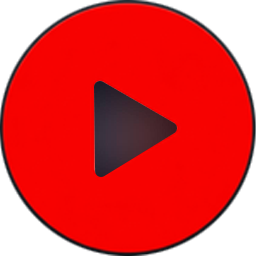

<div align="center">



# YouTube Music Desktop

### A clean, powerful desktop client for YouTube Music on Windows.
*Real 10-band equalizer, picture-in-picture mini player, resumable offline downloads, custom themes, and full Discord status sync.*

[](https://github.com/NYFernando/ytmusic-desktop/releases/latest)
[](https://github.com/NYFernando/ytmusic-desktop/releases/latest)
[](https://github.com/NYFernando/ytmusic-desktop/releases/latest)
[](LICENSE.txt)

<br />

[**⬇️ Download Latest Installer (.exe)**](https://github.com/NYFernando/ytmusic-desktop/releases/latest) &nbsp;&bull;&nbsp; [**✨ Features**](#-what-makes-it-different) &nbsp;&bull;&nbsp; [**⌨️ Hotkeys**](#-keyboard-shortcuts) &nbsp;&bull;&nbsp; [**🛠️ Build From Source**](#-running-from-source-developers)

</div>

---

## 💡 Why this exists

Listening to YouTube Music in a random browser tab gets annoying fast. You lose media keys when you switch windows, there's no real equalizer, you can't easily save tracks offline for trips, and there's no mini player to keep over your code or games.

This app solves all of that. It wraps YouTube Music in a fast, lightweight desktop frame and adds the features you actually want every day.

---

## ✨ What Makes It Different

<table>
  <tr>
    <td width="50%">
      <h3>🎛️ 10-Band EQ & Bass Boost</h3>
      <p>Full control across 10 frequency bands (32Hz to 16kHz) with dedicated preamp gain (-12dB to +12dB) and an analog-style bass boost knob. Comes with instant presets for Rock, Hip-Hop, Acoustic, EDM, and Vocal clarity.</p>
    </td>
    <td width="50%">
      <h3>🪟 Picture-in-Picture Mini Player</h3>
      <p>A compact acrylic widget (330x115) that pins to the corner of your screen. Skip tracks, hit like, adjust volume, and check album art without minimizing your games or work.</p>
    </td>
  </tr>
  <tr>
    <td width="50%">
      <h3>📥 Resumable Offline Downloads</h3>
      <p>Download individual songs or entire playlists directly to MP3. If your Wi-Fi drops or your laptop sleeps, downloads automatically pause and pick back up right where they left off with embedded album art.</p>
    </td>
    <td width="50%">
      <h3>🧰 Movable Floating Quick Dock</h3>
      <p>A floating toolbar inside the browser view that gives you 1-click access to downloads, offline library, and audio tools. Drag it anywhere on screen or click collapse to tuck it into a subtle pill.</p>
    </td>
  </tr>
  <tr>
    <td width="50%">
      <h3>🎨 Custom Themes & Visualizers</h3>
      <p>Choose from Cyberpunk Crimson, Neon Tokyo Cyan, Matrix Emerald, Synthwave Sunset, or OLED Pure Black. Turn on live audio visualizers that react to your music in real time.</p>
    </td>
    <td width="50%">
      <h3>💬 Discord RPC & Sleep Timer</h3>
      <p>Broadcast whatever you're listening to on Discord with album art and live progress bars. Set a sleep timer with gentle 10-second volume fade-out when listening in bed.</p>
    </td>
  </tr>
</table>

---

## 🚀 Quick Install (End Users)

You don't need to install Node.js, Python, or any developer tools to use this app.

1. Go to the [**Releases Page**](https://github.com/NYFernando/ytmusic-desktop/releases/latest).
2. Download `YouTube-Music-Desktop-Setup-1.0.0.exe`.
3. Run the installer and launch the app.
4. *(Optional)* Click the gear icon (**⚙️**) in the top right to sync your existing browser login in one click.

---

## ⌨️ Keyboard Shortcuts

Control your playback from anywhere on your PC, even while inside full-screen games:

| Shortcut | Action |
| :--- | :--- |
| <kbd>Media Play / Pause</kbd> | Play or pause playback |
| <kbd>Media Next</kbd> | Skip to next track |
| <kbd>Media Previous</kbd> | Go back to previous track |
| <kbd>Ctrl</kbd> + <kbd>Alt</kbd> + <kbd>Space</kbd> | Global play / pause toggle |
| <kbd>Ctrl</kbd> + <kbd>Alt</kbd> + <kbd>→</kbd> | Global next track |
| <kbd>Ctrl</kbd> + <kbd>Alt</kbd> + <kbd>←</kbd> | Global previous track |

---

## 🛠️ Running From Source (Developers)

If you'd like to modify or build the app yourself:

```bash
# 1. Clone the repository
git clone https://github.com/NYFernando/ytmusic-desktop.git
cd ytmusic-desktop

# 2. Install dependencies
npm install

# 3. Start development build
npm start

# 4. Compile Windows installer (.exe)
npm run dist
```

---

## 📁 Project Architecture

```
ytmusic-desktop/
├── main.js                  # Main Electron process, shortcuts & Discord RPC
├── preload.js               # Secure IPC bridge for renderer
├── mini-preload.js          # Dedicated bridge for PiP Mini Player
├── webview-preload.js       # YouTube Music DOM hooks & WebAudio DSP taps
├── download-manager.js      # Resumable yt-dlp download queue
├── cookie-importer.js       # Windows DPAPI cookie session sync
├── discord-presence.js      # Discord Rich Presence client
├── bin/                     # Standalone binaries (yt-dlp.exe, ffmpeg.exe)
├── public/
│   ├── index.html           # Main application interface
│   ├── index.css            # Dark theme styles & visualizer canvases
│   ├── renderer.js          # Player controls, dock physics & audio DSP
│   ├── mini-player.html     # Floating PiP player markup
│   ├── mini-player.css      # Acrylic glassmorphism styles
│   └── mini-player.js       # PiP playback sync controller
└── package.json             # Build configuration & scripts
```

---

## 👤 Author

Crafted by **Nethum Fernando**
- GitHub: [@NYFernando](https://github.com/NYFernando)

---

## 📄 License & Notice

This project is created for personal use and desktop convenience. All YouTube and YouTube Music trademarks, logos, and service marks belong to Google LLC.
